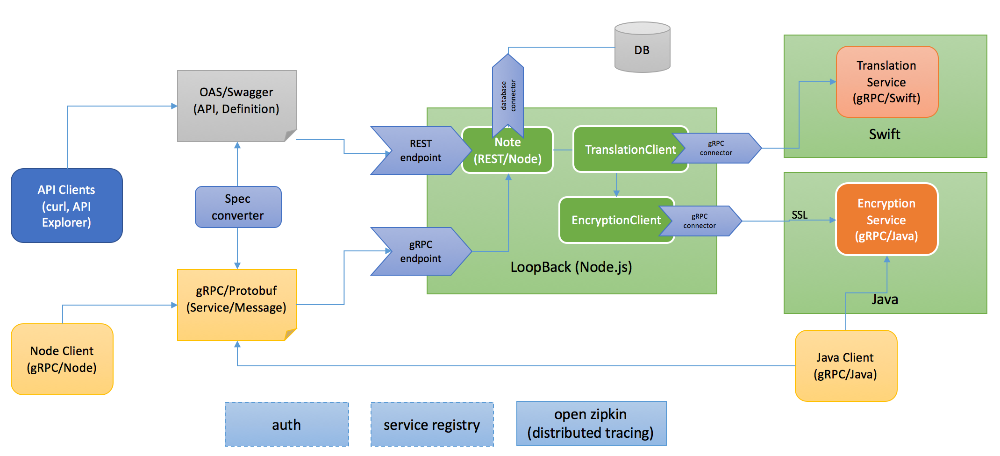

# loopback-example-polyglot
PoC project to illustrate how to create polyglot APIs and Microservices
using [LoopBack](http://loopback.io) and [gRPC](http://grpc.io).

# Modules
- Apps
  - note-java: Java implementation of note encryption
  - note-swift: Swift implementation of note translation
  - note-loopback: Sample LoopBack application to demonstrate gRPC integration
- Tools  
  - grpc-swagger: Generate swagger spec from gRPC proto document and vice versa
  - [loopback-connector-grpc](https://github.com/strongloop/loopback-connector-grpc): LoopBack connector for gRPC services



# Docker Containerization
- note-loopback (Node.js)
- note-java (Java)
- note-swift (Swift)
- note-mongo (MongoDB)
- openzipkin/zipkin ([zipkin](http://zipkin.io/))


# Running with docker-compose

```
$ docker-compose up --build
```

Open your browser and point to http://localhost:3000/explorer to test drive:

1. Create a new note with `POST /notes`.
2. The `note-loopback` microservice will request the `note-swift` microservice to translate the content (mockup).
3. The `note-loopback` microservice will request the `note-java` microservice to encrypt the content using JWE.
4. Tracing metrics are sent to zipkin server. The dashboard is available at http://localhost:9411.
5. You can also run clients from the host, for example:
```
$ cd note-loopback
$ node client.js

or 

$ cd note-java
$ java -cp ./target/note-1.0.0.jar com.ibm.apiconnect.demo.polyglot.NoteClient
```

# Running as local Kubernetes (minikube)
 
Please follow instructions at https://github.com/kubernetes/minikube to install `minikube` and `kubectl` commands.

```
cd kubernetes
./create-k8s.sh
```

